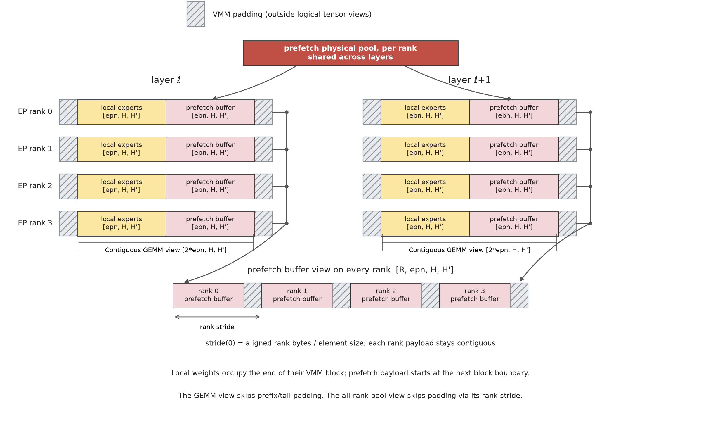

# MoonEP

MoonEP is an Expert Parallelism communication library that keeps token loads perfectly balanced across ranks via dynamic redundant experts.

**Notation**: `S` = input tokens per rank, `K` = routed top-k per token.

1. **Perfect balance**: every rank receives exactly `S × K` tokens, no matter how skewed the routing is. A small number of redundant experts is planned online from the current router outputs and prefetched before expert computation; their gradients are reduced back to their home ranks in the backward pass.
2. **Online planning**: a near-optimal GPU planning kernel with negligible overhead
3. **Zero copy and static shapes**: fused permute/unpermute — tokens are sent directly to their expert-grouped positions on remote ranks and buffer views are returned to the computation. Only a fixed `S × K` buffer is needed, and statically known shapes eliminate per-layer MoE host synchronization.

## Performance

Both benchmarks run on H20 with EP=8, sweeping the router imbalance:

$$\text{maxvio} = \max_e \left( \frac{T_e}{\bar{T}} \right) - 1$$

where $T_e$ is the number of tokens routed to expert $e$, and $\bar{T}$ is the expected tokens per expert under perfect balance (maxvio = 0 means perfectly balanced).

**Communication vs DeepEP v2** ([benchmarks/bench_vs_deepep.py](benchmarks/bench_vs_deepep.py)):


- **Zero copy makes raw communication faster**: tokens are written directly to their final expert-grouped positions on remote ranks — no permute in, no permute out — and views of the communication buffer are handed straight to the computation, eliminating the comm-buffer → user-buffer copy that dominates the epilogue. MoonEP's comm time is consistently below DeepEP v2 at every imbalance level.
- **Perfect balance makes it immune to imbalance**: MoonEP's comm time stays almost flat as maxvio grows, while DeepEP v2 — whose latency is set by the hottest rank — degrades steadily.
- **The comparison counts MoonEP's extra kernels**: MoonEP adds planning and weight-prefetch kernels that DeepEP does not need, and they are already stacked in the bars above. Even with the whole critical path included, total dispatch time is on par with DeepEP v2's dispatch alone and pulls ahead under imbalance, while combine is significantly faster at every level.

**End-to-end training**:


- **DeepEP degrades with imbalance**: the hottest ranks receive more tokens, so iteration time climbs steadily as maxvio grows; meanwhile the ever-changing activation shapes fragment GPU memory, until training OOMs at high imbalance.
- **MoonEP is unaffected**: every rank always computes exactly `S × K` tokens per layer, so iteration time stays flat at every imbalance level; fully static memory shapes mean no fragmentation, and training never OOMs.

## Supported Devices

- NVIDIA GPU
- Zhenwu PPU (under review, coming soon)

## Usage

### Integration

**Notation**: `S` = input tokens per rank, `K` = routed top-k per token, `E` = total routed experts in the EP group, `R` = number of EP ranks (EP comm size), `epn = E/R` = local experts and prefetch/reduce slots per rank, `NvS` = dispatched token slots per rank (`S × K` real tokens plus per-VM-group padding), `H` = hidden size, `H'` = expert FFN intermediate size.

MoonEP's communication API receives each projection as a local expert tensor `[epn, H, H']` plus an all-rank prefetch-buffer view `[R, epn, H, H']`. The integrating framework exposes this rank's local experts followed by its local prefetch slice as one contiguous `[2*epn, H, H']` compute view for the VM group GEMM; the planner-produced `cu_seqlens[2*epn]` selects the active rows.

#### Weight buffer



For each expert projection (gate/up/down), the framework builds two related views:

- **Communication view `[R, epn, H, H']`**: all ranks' prefetch pools mapped directly for `buffer.prefetch_weight`.
- **Compute view `[2*epn, H, H']`**: rows `[0, epn)` alias this rank's local parameter weights; rows `[epn, 2*epn)` alias this rank's prefetch slice. The VM group GEMM and `cu_seqlens` use this compact row order without mapping the other ranks' parameter weights.

Each rank's prefetch pool is process-global and shared by all layers, so the extra physical cost is `epn` expert weights per projection in total, not per layer.

Each rank has `epn` prefetch slots. The planner moves experts from at most one remote home group to each destination rank, so these slots cover every remote expert segment.

#### Gradient buffers (training only)


Training mirrors the compact weight layout in fp32:

- **Local grad `[epn, H, H']`**: this rank's parameter grads.
- **Compute grad view `[2*epn, H, H']`**: the local grad followed by this rank's reduce-buffer slice. The tail contains temporary prefetch-slot grads and stays separate from the framework's own parameter-grad reduction.
- **Reduce buffer**: every rank maps all `R` reduce buffers as one `[R, epn, H, H']` view. `reduce_grad` lets each rank read the slots holding its own experts' grads from every rank's reduce buffer (remote reads over NVLink), accumulate them into its local parameter grad, then zero its own consumed slots for the next microbatch.

### API walkthrough

```python
from moonep import Buffer

buffer = Buffer(S=4096, H=7168, K=8, E=256, num_ep_ranks=8,
                num_sms=32, token_padding=128)
```

- `num_sms=None` defaults to 32. The current implementation derives `epn = E // num_ep_ranks` internally.
- `dispatch` / `combine` / `prefetch_weight` / `reduce_grad` all accept `async_finish=True` to run on the comm stream and return a CUDA event.
- `combine` defaults to `inter_rank_sync=True`, which runs an explicit rank sync before staging. Pass `inter_rank_sync=False` to skip this pre-staging sync; the combine kernel still performs its own entry cross-rank barrier.

#### dispatch fwd

```python
hidden_nvsh, route_weights_nvs, cu_seqlens, plan = buffer.dispatch(
    hidden_sh,          # [S, H] bf16
    route_weights_sk,   # [S, K] fp32
    topk_experts_sk,    # [S, K] int32
    tokens_per_expert,  # [E] int32, local count
)
# hidden_nvsh:       [NvS, H] bf16 — dispatched tokens in physical VM group order
# route_weights_nvs: [NvS] fp32
# cu_seqlens:        [2*epn] int32 — padded token end offset per VM group row
# plan:              MoonEPCommPlan — save it for prefetch/combine and both backward passes

buffer.prefetch_weight(
    plan=plan,
    local_gate_weight=local_gate_weight,        # [epn, H, H'] bf16
    local_up_weight=local_up_weight,            # [epn, H, H'] bf16
    local_down_weight=local_down_weight,        # [epn, H, H'] bf16
    gate_prefetch_buffer=gate_prefetch_buffer,  # [R, epn, H, H'] bf16
    up_prefetch_buffer=up_prefetch_buffer,      # [R, epn, H, H'] bf16
    down_prefetch_buffer=down_prefetch_buffer,  # [R, epn, H, H'] bf16
)
# The framework's GEMM view aliases local_*_weight followed by this rank's
# *_prefetch_buffer slice as [2*epn, H, H'].
```

#### dispatch bwd

Backward of dispatch: sum each token's K dispatched grad copies back to token-major — a combine — and reduce duplicated experts' weight grads back to their home ranks.

```python
grad_hidden_sh, _, _ = buffer.combine(
    plan=plan,
    hidden_nvsh=grad_hidden_nvsh,    # [NvS, H] bf16
)
# grad_hidden_sh: [S, H] bf16

buffer.reduce_grad(
    plan=plan,
    local_gate_grad=local_gate_grad,          # [epn, H, H'] fp32
    local_up_grad=local_up_grad,              # [epn, H, H'] fp32
    local_down_grad=local_down_grad,          # [epn, H, H'] fp32
    gate_reduce_buffer=gate_reduce_buffer,  # [R, epn, H, H'] fp32
    up_reduce_buffer=up_reduce_buffer,      # [R, epn, H, H'] fp32
    down_reduce_buffer=down_reduce_buffer,  # [R, epn, H, H'] fp32
)
# The framework's GEMM grad view aliases local_*_grad followed by this rank's
# *_reduce_buffer slice as [2*epn, H, H'].
```

#### combine fwd

```python
output_sh, gathered_route_weights_sk, _ = buffer.combine(
    plan=plan,
    hidden_nvsh=expert_output_nvsh,       # [NvS, H] bf16
    route_weights_nvs=route_weights_nvs,  # [NvS] fp32, optional
)
# output_sh:                 [S, H] bf16 — combined token-major output
# gathered_route_weights_sk: [S, K] fp32 or None — routing weights gathered back to token-major
```

#### combine bwd

Backward of combine: scatter the output grad back to VM group order by re-dispatching with the saved plan — planning is skipped and no prefetch is needed.

```python
grad_expert_output_nvsh, _, _, _ = buffer.dispatch(
    grad_output_sh,    # [S, H] bf16
    plan=plan,
)
# grad_expert_output_nvsh: [NvS, H] bf16
```

#### zero_copy

By default `dispatch` returns fresh tensors and `combine` first copies its inputs into the NVL shard. With `zero_copy=True` on both sides, `dispatch` returns views of the communication buffer and the expert FFN reads/writes them in place — no boundary copy at all:

```python
hidden_nvsh, route_weights_nvs, cu_seqlens, plan = buffer.dispatch(
    hidden_sh, route_weights_sk, topk_experts_sk, tokens_per_expert,
    zero_copy=True,
)
# hidden_nvsh / route_weights_nvs are views of the NVL buffer;
# the expert FFN must write its output in place on hidden_nvsh
output_sh, gathered_route_weights_sk, _ = buffer.combine(
    plan=plan,
    hidden_nvsh=hidden_nvsh,
    route_weights_nvs=route_weights_nvs,
    zero_copy=True,  # asserts the inputs are exactly the views from dispatch
)
```

- The views alias buffer state that the next `dispatch` / `combine` overwrites — do not hold them across communication calls (autograd must not save them for backward; that case requires `zero_copy=False`).

```python
# explicitly release VMM/NVLink resources held by the Buffer before destroying the process group
buffer.destroy()
```

## Build & Test

```bash
pip install -e .

# run tests (requires multiple GPUs + NVLink)
torchrun --nproc_per_node=8 -m pytest tests/test_planning.py
torchrun --nproc_per_node=8 -m pytest tests/test_dispatch.py
torchrun --nproc_per_node=8 -m pytest tests/test_combine.py
torchrun --nproc_per_node=8 -m pytest tests/test_e2e.py
torchrun --nproc_per_node=8 -m pytest tests/test_grad_reduce.py
torchrun --nproc_per_node=8 -m pytest tests/test_prefetch.py
```

## Acknowledgments

This library is inspired by the following works:

- [DeepEP](https://github.com/deepseek-ai/DeepEP)
- [Echo](https://arxiv.org/abs/2603.07685)
- [UltraEP](https://github.com/Dots-Infra/UltraEP)
- AcclEP (Alibaba's EP communication library)

## Citation

```bibtex
@misc{moonep2026,
      title={MoonEP: A Perfectly Balanced Expert Parallelism Library via Dynamic Redundant Experts},
      author={Yutian Chen, Cong Li, Yucheng Wang, Ming Wei},
      year={2026},
      publisher = {GitHub},
      howpublished = {\url{https://github.com/MoonshotAI/MoonEP}},
}
```
